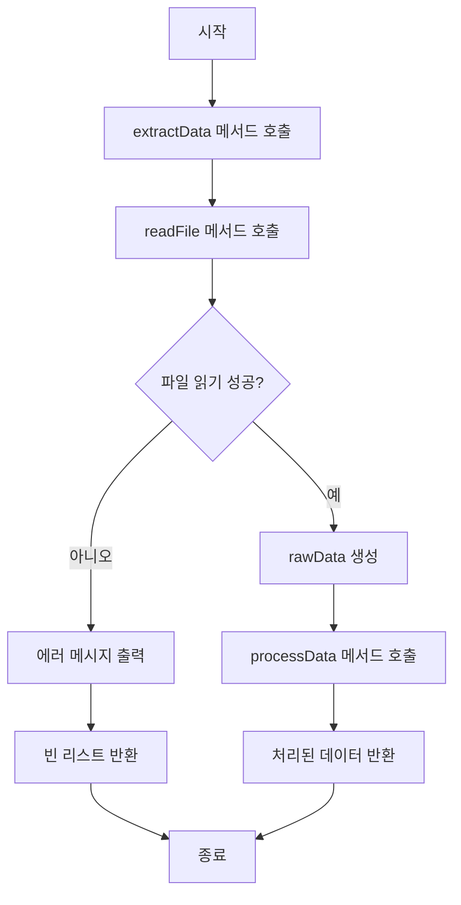
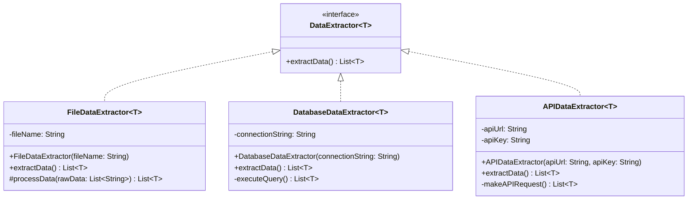

# abstract vs interface

자바에서 `abstract`와 `interface` 사용에 있어 헷갈립니다. 대부분 순수 추상 클래스(추상 메서드만 존재하는 클래스)인 `interface`로 대부분 구현이 가능하기 때문이라고 생각합니다.   
그럼에도 불구하고 `abstract class` 가 존재하는 이유가 있을 것이고, 그 이유에 대해 찾아가보겠습니다.

## 관계 표현을 통한 차이

`abstract class` : 불완전하므로 생성이 되지 않지만, 클래스이므로 역할을 나타내는 개념을 가지고 있습니다. `abstract class` 를 확장해서 구현한 클래스는 `abstract class`의 개념을 가지고 있어야 합니다.(is-a)

`interface` : 다중 상속이 가능하고, 선언한 모든 메서드가 `public abstract` 입니다. `interface` 를 `implements` 한 클래스들은 `interface` 에 선언된 메서드를 구현해야 하는 책임을 가집니다.(규약)

## 예제를 통해 알아보는 적절한 사용 예시

```text
123
test@example.com
456
invalid.email
789
Wrong line
another@email.com
```

위와 같은 .txt 파일로부터 숫자 또는 이메일을 추출해보겠습니다.   
추출 방식은 다음과 같습니다.
1. .txt 파일을 가져온다.
2. 한 줄씩 읽으면서 숫자 또는 이메일이면 추출한다.
3. 추출한 값들을 반환한다.

먼저 로직에 맞게 틀을 만듭니다. 틀은 `abstract class` 로 만듭니다.

```java
public abstract class FileDataExtractor<T> {

    protected String fileName;

    protected FileDataExtractor(String fileName) {
        this.fileName = fileName;
    }

    public final List<T> extractData() {
        List<String> rawData = readFile();
        return processData(rawData);
    }

    private List<String> readFile() {
        List<String> lines = new ArrayList<>();

        try (BufferedReader br = new BufferedReader(new FileReader(fileName))) {
            String line;

            while ((line = br.readLine()) != null) {
                lines.add(line);
            }
        } catch (IOException e) {
            System.err.println("파일을 읽는 중 에러 발생: " + e.getMessage());
        }

        return lines;
    }

    protected abstract List<T> processData(List<String> rawData);
}
```



틀을 만들었습니다. 파일을 가져와 읽는 것, 추출하는 것은 공통로직입니다.   
어떤 타입을 반환할지만 다르므로 `abstract class` 를 `extends` 하여 완성하면 됩니다.
숫자와 이메일을 추출하는 클래스를 만들어보겠습니다.

```java
// 숫자 추출
public class NumberExtractor extends FileDataExtractor<Integer> {

    public NumberExtractor(String fileName) {
        super(fileName);
    }

    @Override
    protected List<Integer> processData(List<String> rawData) {
        List<Integer> numbers = new ArrayList<>();

        for (String line : rawData) {
            try {
                numbers.add(Integer.parseInt(line.trim()));
            } catch (NumberFormatException e) {
                System.out.println("숫자가 아닌 값 무시: " + line);
            }
        }

        return numbers;
    }
}
```

```java
// 이메일 추출
public class EmailExtractor extends FileDataExtractor<String> {

    private  static final Pattern EMAIL_PATTERN =
            Pattern.compile("^[\\w+.-]+@[\\w+.-]+$");

    public EmailExtractor(String fileName) {
        super(fileName);
    }

    @Override
    protected List<String> processData(List<String> rawData) {
        List<String> emails = new ArrayList<>();

        for (String line : rawData) {
            if (EMAIL_PATTERN.matcher(line.trim()).matches()) {
                emails.add(line.trim());
            } else {
                System.out.println("유효하지 않은 이메일 무시: " + line);
            }
        }

        return emails;
    }
}
```

`FileDataExtractor` 라는 틀을 만들고, 이를 상속받은 `NumberExtractor`, `EmailExtractor` 를 완성하여 숫자 추출기와 이메일 추출기를 만들었습니다.   

**abstract class를 사용할 때의 이점**:   
- 코드 재사용: 파일 읽기와 같은 부분을 재사용합니다. JSON 파일 추출기를 추가로 만들 때, 파일 읽기 로직을 작성할 필요가 없고, JSON 형식에 대해서만 구현하면 됩니다.
- 강제적인 구조: 하위 클래스가 따라야 할 구조적 틀을 제공하고 강제합니다. 이는 일관성을 유지하게 합니다. 하위 클래스를 구현할 때, `FileDataExtractor` 설계 의도를 명확히 들어내, 구조를 쉽게 파악하고 기존 구조를 따를 수 있게 합니다.


코드에 `interface` 를 추가해보겠습니다.   

```java
public interface DataExtractor<T> {
    List<T> extractData();
}
```

```java
public abstract class FileDataExtractor<T> implements DataExtractor<T> {

    protected String fileName;

    protected FileDataExtractor(String fileName) {
        this.fileName = fileName;
    }

    @Override
    public final List<T> extractData() {
        List<String> rawData = readFile();
        return processData(rawData);
    }

    private List<String> readFile() {
        List<String> lines = new ArrayList<>();

        try (BufferedReader br = new BufferedReader(new FileReader(fileName))) {
            String line;

            while ((line = br.readLine()) != null) {
                lines.add(line);
            }
        } catch (IOException e) {
            System.err.println("파일을 읽는 중 에러 발생: " + e.getMessage());
        }

        return lines;
    }

    protected abstract List<T> processData(List<String> rawData);
}

```

`interface` 를 추가하여도 이전과 동작에 있어서 차이는 없습니다.
다만, 조금 더 유연하게 설계되었습니다. 예시를 통해 이점을 살펴보겠습니다.   
현재는 파일데이터 추출기입니다. 하지만 추후에 파일데이터 추출기를 사용하는 곳에서 API나 데이터베이스에서 데이터를 추출이 필요할 수 있습니다.   
파일에서 데이터를 추출하는 방식과 API 또는 데이터베이스에서 데이터를 추출하는 방식이 다르므로 기존 구조를 사용할 수 없습니다. 모두 데이터 추출이라는 행동을 하지만 기존 구조의 강제로 인해 사용할 수 없는 것입니다.   
`interface` 를 통해 이를 해결합니다. 



```java
public interface DataExtractor<T> {
    List<T> extractData();
}

public class DatabaseExtractor<T> implements DataExtractor<T> {
    // 데이터베이스에서 데이터를 추출하는 로직
}

public class APIExtractor<T> implements DataExtractor<T> {
    // 외부 API에서 데이터를 추출하는 로직
}

public class DataProcessor<T> {
    private DataExtractor<T> extractor;

    public DataProcessor(DataExtractor<T> extractor) {
        this.extractor = extractor;
    }

    public void processData() {
        List<T> data = extractor.extractData();
        // 데이터 처리 로직
    }
}

// 사용 예
DataProcessor<User> processor = new DataProcessor<>(new FileDataExtractor<>("users.txt"));
DataProcessor<User> processor = new DataProcessor<>(new DatabaseExtractor<>());
DataProcessor<User> processor = new DataProcessor<>(new APIExtractor<>());
```

```java
// 테스트 예제
public class MockDataExtractor<T> implements DataExtractor<T> {
    private List<T> mockData;

    public MockDataExtractor(List<T> mockData) {
        this.mockData = mockData;
    }

    @Override
    public List<T> extractData() {
        return mockData;
    }
}

@Test
public void testDataProcessor() {
    List<Integer> mockData = Arrays.asList(1, 2, 3, 4, 5);
    DataExtractor<Integer> mockExtractor = new MockDataExtractor<>(mockData);
    DataProcessor<Integer> processor = new DataProcessor<>(mockExtractor);

    // 테스트 로직
}
```
```java
// 플러그인 예제
public class DataExtractorRegistry {
    private Map<String, DataExtractor<?>> extractors = new HashMap<>();

    public void registerExtractor(String name, DataExtractor<?> extractor) {
        extractors.put(name, extractor);
    }

    public DataExtractor<?> getExtractor(String name) {
        return extractors.get(name);
    }
}

// 사용 예
DataExtractorRegistry registry = new DataExtractorRegistry();
registry.registerExtractor("file", new FileDataExtractor<>("data.txt"));
registry.registerExtractor("db", new DatabaseExtractor<>());

DataExtractor<?> extractor = registry.getExtractor(configValue);
```

데이터 추출이 필요한 곳에서는 `DataExtractor` 만을 의존하고, 구현체들은 `DataExtractor` 를 `implements` 하여 구현합니다.   
`FileDataExtractor` 라는 구체적인 구현체를 바라보는 것이 아니라 추상화된 `DataExtractor`를 바라봄으로써 코드의 유연성과 확장성을 향상시킵니다.(DIP 적용, OCP 준수)   

## 결론

- 추상 클래스(abstract class)와 인터페이스(interface)는 서로 베타적인 개념이 아니라 상호 보완적인 관계입니다.   
- 둘 다 추상화를 제공한다는 공통점이 있지만, 각자마다의 이점이 있습니다.(상황에 맞게 사용하는 것이 중요!)   
- 추상클래스의 강점: 
    - 공통 기능 구현
    - 필드 포함
    - 계층 구조에서 기본 클래스로 적합
- 인터페이스의 강점
    - 다중 구현 가능
    - 행동(계약) 정의
    - 높은 수준의 추상화
- 두 가지를 사항에 맞게 적절히 사용한다면 확장성, 유지보수성을 극대화할 수 있습니다.

## 예제 코드

[깃허브 예제 코드](https://github.com/biddan606/my-lab/tree/main/abstract-vs-inteface)


## 참조 영상

- [Abstract Classes and Methods in Java Explained in 7 Minutes - Coding with John](https://www.youtube.com/watch?v=HvPlEJ3LHgE)

- [Learn How to Use Abstract Classes - 
Amigoscode](https://www.youtube.com/watch?v=5qP-lcg53H0)
