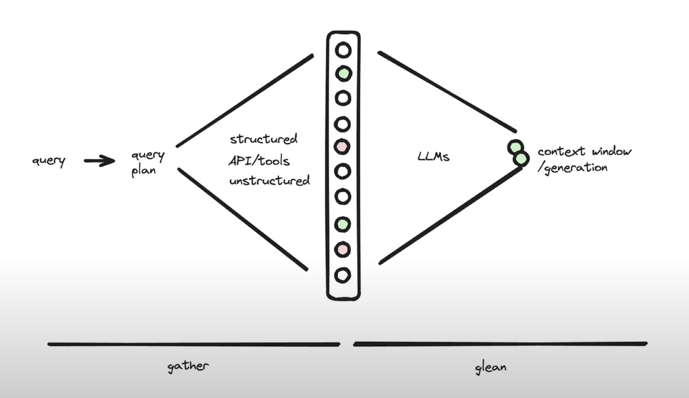

# **컨텍스트 엔지니어링**

### **AI는 매번 나를 잊는다.**

우리가 ChatGPT와 같은 LLM(대규모 언어 모델)과 상호작용할 때 주로 겪는 문제가 있습니다. LLM은 이전 대화를 기억하지 못합니다. 매번 새로운 상호작용은 백지상태에서 시작됩니다. 그럼에도 불구하고 우리가 대화를 이어갈 수 있는 이유는, 채팅 애플리케이션이 보이지 않는 곳에서 이전 대화 기록을 현재 질문과 함께 매번 다시 전달해주기 때문입니다. 이것이 바로 컨텍스트 엔지니어링의 가장 기본적인 형태입니다.

AI 기술이 발전하며 '프롬프트 엔지니어링', 'RAG' 등 다양한 용어들이 등장했습니다. **이러한 개념들을 아우르는 가장 적절한 상위 개념으로서 '컨텍스트 엔지니어링'을 명확히 정의**하고, AI 애플리케이션의 성능과 신뢰성을 높이기 위한 체계적인 방법론을 정리하는 것을 목표로 합니다.

## **1. 컨텍스트 엔지니어링의 핵심 개념과 목표**

### **1.1. 컨텍스트 창에 무엇을 넣을지 결정하는 모든 과정**

가장 간단하게, 컨텍스트 엔지니어링은 LLM이 응답을 생성하기 위해 참조하는 정보의 집합, 즉 '컨텍스트 창(Context Window)'을 어떻게 구성하고 채울 것인지를 설계하고 관리하는 모든 활동을 의미합니다. 이는 단순히 사용자의 질문(프롬프트)뿐만 아니라, 관련 문서, 대화 기록, 도구(API) 정보 등 LLM이 작업을 수행하는 데 필요한 모든 정보 환경을 체계적으로 구축하는 과정입니다.

### **1.2. 궁극적 목표: 신뢰성 있고(Reliable), 빠르고(Fast), 저렴한(Cheap) AI 시스템 구축**

컨텍스트 엔지니어링을 활용하는 AI 시스템은 3가지 목표를 가집니다.

1.  **신뢰성**: 환각(Hallucination)을 줄이고, 예측 가능하며 일관된 결과를 도출합니다. (현재 대부분의 노력이 집중되는 단계)
2.  **속도**: 불필요한 정보를 제거하고 컨텍스트를 최적화하여 응답 속도를 향상시킵니다.
3.  **비용**: 토큰 사용량을 효율적으로 관리하여 API 호출 비용을 절감합니다.

## **2. 왜 컨텍스트 엔지니어링이 필수인가?**

### **2.1. 프롬프트 엔지니어링의 명백한 한계**

초기 LLM의 등장은 정교한 단일 프롬프트만으로도 놀라운 결과를 만들 수 있다는 가능성을 보여주며 '프롬프트 엔지니어링' 시대를 열었습니다. 하지만 실제 상용 애플리케이션(프로덕션)을 구축하는 단계에서는 명백한 한계가 있습니다.

이 한계를 이해하기 위해 **"LLM은 CPU, 컨텍스트는 RAM"**이라는 비유를 사용할 수 있습니다. LLM이 아무리 뛰어난 연산 능력(CPU)을 가졌더라도, 작업에 필요한 데이터를 담는 작업 공간(RAM)이 부실하면 그 성능을 제대로 발휘할 수 없습니다. 프롬프트 엔지니어링만으로는 이 RAM을 효과적으로 채우고 관리하는 데 한계가 있으며, 이는 다음과 같은 문제로 이어집니다.

- **환각 (Hallucination)**: RAM(컨텍스트)에 명확한 사실 데이터가 없으면, CPU(LLM)는 주어진 프롬프트에 이어질, 통계적으로 가장 그럴듯한 단어를 예측하는 확률적 연산에만 의존하게 됩니다. 이 과정에서 모델의 방대한 훈련 데이터에 기반한 '그럴듯함'이 '사실'을 앞지르게 되어, 실제로는 존재하지 않는 정보를 사실처럼 생성하는 현상이 바로 환각입니다.
- **외부/최신 정보 접근 불가**: RAM에 최신 정보나 내부 데이터를 넣어주지 않으면 CPU는 이를 알 방법이 없습니다.
- **상태 유지의 어려움 (Statelessness)**: 매번 상호작용할 때마다 RAM이 초기화되기 때문에, 이전 작업 내용(상태)을 유지하기 어렵습니다.

### **2.2. 해결책? 긴 컨텍스트 창(Long Context Window)**

그렇다면 단순히 컨텍스트 창의 크기를 늘리면 모든 문제가 해결되지 않을까? 필요한 모든 정보를 한 번에 넣어주면 될 것이라는 생각은 직관적이고 합리적으로 들립니다.
하지만 현실은 다릅니다. 단순히 컨텍스트의 양을 늘리는 것이 완벽한 해결책이 되지는 못합니다. 정보가 컨텍스트 창 안에 '존재'하는 것과, LLM이 그 정보를 효과적으로 '활용'하는 것은 별개의 문제이기 때문입니다.
실제 복잡한 작업에서는 컨텍스트 길이가 길어질수록, LLM이 컨텍스트의 중간에 있는 정보를 놓치거나 무시하여 성능이 급격히 저하되는 **"Lost in the middle"** 현상이 발생합니다. 이는 아무리 중요한 정보라도 긴 문서의 중간에 묻혀 있다면, 모델이 그 중요성을 인지하지 못하고 답변에 반영하지 않을 수 있음을 의미합니다.

이 현상의 원인으로는 다음과 같은 가설들이 있습니다:

- **주의(Attention) 메커니즘의 한계**: 트랜스포머 아키텍처의 주의 메커니즘이 문서의 시작과 끝 부분에 더 많은 가중치를 두도록 설계되어, 구조적으로 중간 부분에 대한 집중력이 떨어질 수 있습니다.
- **인지 과부하**: 인간이 너무 긴 글을 읽을 때 집중력을 잃는 것처럼, LLM 역시 처리해야 할 정보량이 임계점을 넘어서면 토큰 간의 관계나 중요도를 추적하는 능력이 저하될 수 있습니다.

결론적으로, 거대한 컨텍스트 창은 만능 해결책이 아닙니다. 중요한 것은 컨텍스트의 절대적인 '양'이 아니라, 어떻게 핵심 정보를 선별하고 구조화하여 전달하는가 하는 **'질'**의 문제입니다.

## **3. 실전 방법론: Gather and Glean**

앞서 우리는 긴 컨텍스트의 한계로 인해 **"얼마나 많은 정보를 넣느냐가 아니라, 어떤 정보를 어떻게 선별하고 구조화하여 넣느냐"**가 컨텍스트 엔지니어링의 핵심 과제임을 확인했습니다. 'Gather and Glean'은 바로 이 과제를 해결하기 위한 체계적이고 실용적인 2단계 방법입니다.

### **3.1. 1단계: Gather (수집) - 넓은 그물 던지기 (Recall 극대화)**

이 단계의 목표는 마치 넓은 그물을 던지듯, LLM이 작업을 수행하는 데 잠재적으로 관련될 수 있는 모든 정보 소스를 최대한 폭넓게 수집하는 것입니다. 관련 없는 정보가 일부 포함될 위험을 감수하더라도, 중요한 정보를 놓치지 않는 것이 핵심입니다. **품질보다는 양**에 집중하는 단계입니다.

- **수집 대상**: 구조/비구조 데이터(Vector DB), SQL 데이터베이스, 로컬 파일, 사용 가능한 API/도구 목록, 웹 검색 결과, 이전 대화 기록 등

### **3.2. 2단계: Glean (정제) - 옥석 가리기 (Precision 극대화)**

이 단계의 목표는 Gather 단계에서 수집한 방대한 정보(그물에 걸린 모든 것) 속에서 불필요한 노이즈를 제거하고, 현재 작업에 가장 중요하고 관련성 높은 핵심 정보(옥석)만을 선별하여 최종 컨텍스트를 구성하는 것입니다. **양보다는 품질**에 집중하는 단계입니다.

- **주요 기술**: Reranking, LLM을 활용한 요약 및 필터링 (저렴하고 빠른 소형 모델 병렬 사용) 등

## **4. 시스템의 기둥: 결정론적 컨텍스트의 구성 요소**

'Gather and Glean'을 통해 우리가 직접 통제하고 구성하는 컨텍스트를 **결정론적 컨텍스트(Deterministic Context)**라고 부릅니다. 이 시스템을 이루는 핵심 기둥은 다음과 같습니다.

- **4.1. 메모리 (Memory)**: 과거를 기억하게 하는 힘

  - **단기 기억**: 현재 대화의 맥락을 유지 (채팅 히스토리 요약 등)
  - **장기 기억**: 여러 세션에 걸친 사용자 프로필, 선호도, 과거 상호작용 기록 (주로 Vector DB 활용)

- **4.2. 상태 관리 (State Management)**: 작업의 진행 상황 추적

  - 다단계 작업(예: 항공권 예약 → 호텔 예약 → 렌터카 예약)의 현재 단계를 추적합니다.
  - **_Memory와의 차이점_**:
    - **Memory**: "**무엇을** 알고 있는가?" (정보의 내용)
    - **State**: "**어디까지** 진행했는가?" (작업의 단계)

- **4.3. 지식 기반 연결 (Knowledge Grounding)**: 외부 지식 연결

  - 핵심 기술은 **검색 증강 생성(RAG)**으로, LLM이 응답하기 전에 신뢰할 수 있는 외부 지식 소스를 참조하게 하여 환각을 줄이고 답변의 신뢰도를 높입니다.

- **4.4. 도구 사용 (Tool Use)**: 행동력 부여

  - LLM이 API를 호출하거나 코드를 실행하는 등 외부 세계와 상호작용하고 실제 행동을 수행할 수 있게 합니다.

- **4.5. 프롬프트 (Prompt)**: 동적으로 조립되는 최종 명령어
  - 사용자의 원래 질문은 위 요소들(메모리, RAG 결과, 도구 정보)과 함께 동적으로 조립되어, 최종적으로 LLM에게 전달되는 컨텍스트의 마지막 부분을 차지합니다.

## **5. 심화: 에이전트를 위한 컨텍스트 엔지니어링**

AI 에이전트는 웹 검색과 같이 통제 불가능한 **확률론적 컨텍스트**를 다루기 때문에, 더욱 고도화된 컨텍스트 엔지니어링 전략이 필요합니다. 이는 다음과 같은 영역으로 나누어 볼 수 있습니다.

### **5.1. 답변 품질 향상을 위한 전략**

- **실패 사례로부터의 학습**: 에이전트에게 과거의 성공 사례보다 **실패 사례**를 컨텍스트로 제공했을 때, 잘못된 패턴에서 벗어나 성능이 향상되는 경향이 있습니다.
- **정보 중요도 평가 (Relevance Scoring)**: 검색된 여러 정보들 중에서 현재 작업과 더 관련성이 높은 정보에 가중치를 부여하여, LLM이 더 중요한 정보에 집중하도록 유도합니다.

### **5.2. 해결해야 할 과제와 위험**

- **출처 품질 모니터링**: 에이전트가 웹 검색 시 신뢰할 수 없는 정보나 편향된 소스를 사용하는지 지속적으로 감사하고 추적하는 체계가 필요합니다. 이는 해결해야 할 중요한 과제입니다.
- **보안 위협 대비**: 악의적으로 조작된 웹사이트를 통해 에이전트를 공격하는 **LLM 인젝션**과 같은 새로운 보안 위협을 예상하고 이에 대비해야 합니다.

### **5.3. 미래의 기술: 컨텍스트 압축의 과제**

- **컨텍스트 압축 (Compaction)**: 에이전트가 여러 단계의 작업을 수행하며 생성하는 방대한 로그와 대화 기록을 다음 행동을 위해 효과적으로 요약하고 압축하는 기술은 미래에 매우 중요해질 것입니다. 하지만 **현재의 압축 기술들은 아직 성능이 미미**하며, 의미 손실 없이 정보를 효율적으로 압축하는 더 나은 방법론이 필요합니다.

### **결론: '시스템 아키텍트'로서의 AI 개발자**

컨텍스트 엔지니어링은 AI 시대의 개발자가 '프롬프트 장인(Prompt Crafter)'을 넘어 **'시스템 아키텍트(System Architect)'**가 되어야 함을 시사합니다.

AI의 진정한 힘은 모델 자체의 크기나 능력뿐만 아니라, 그 모델이 세상을 이해하고 상호작용할 수 있도록 우리가 제공하는 **컨텍스트의 깊이와 질**에 의해 결정됩니다.

미래의 AI 개발은 통제 가능한 **결정론적 컨텍스트**를 'Gather and Glean'과 같은 공학적 방법론으로 정교하게 설계하고, 통제 불가능한 **확률론적 컨텍스트**를 현명하게 이끌어가는 능력이 핵심이 될 것입니다.

### 참조

- [Context Engineering vs. Prompt Engineering: Smarter AI with RAG & Agents - IBM Technology](https://www.youtube.com/watch?v=vD0E3EUb8-8)
- [Context Engineering, Clearly Explained - Matt Maher](https://www.youtube.com/watch?v=p6s82Ax8yrs)
- [컨텍스트 엔지니어링 대 프롬프트 엔지니어링: LLM 에이전트 안내 - AI News & Strategy Daily | Nate B Jones](https://www.youtube.com/watch?v=mldfMWbnZTg)
- [엔지니어를 위한 컨텍스트 엔지니어링 - YC Root Access](https://www.youtube.com/watch?v=3jN77Aw7Utk)
