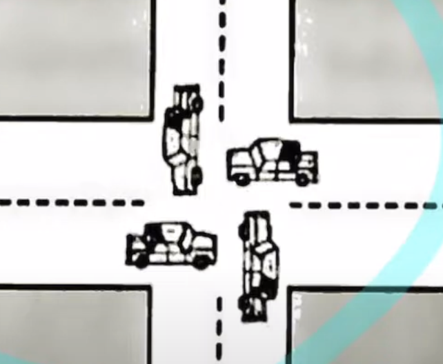
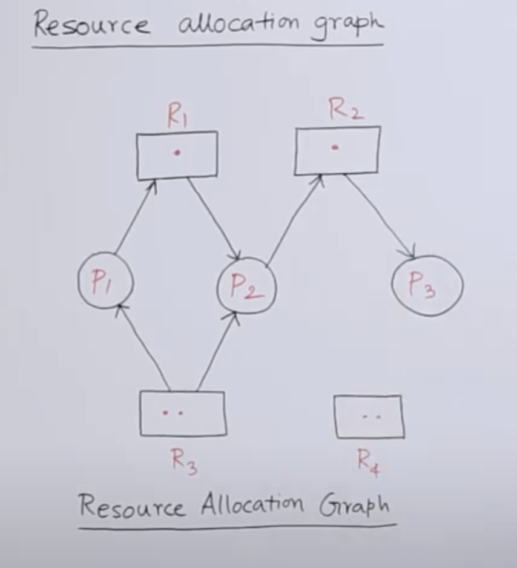
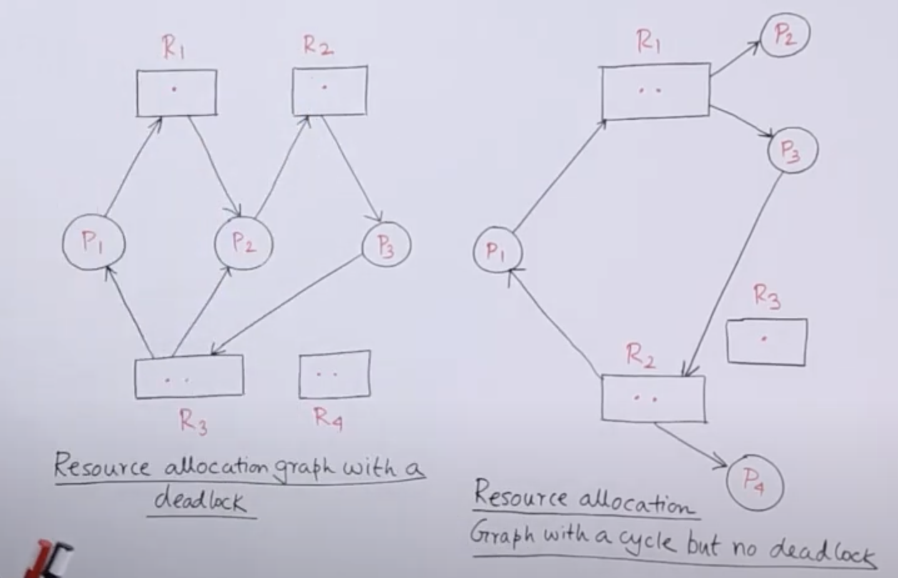
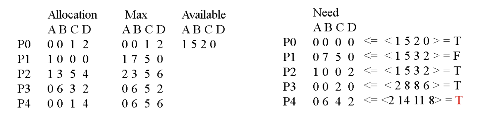

# deadlock(교착 상태)

데드락이란 2개 이상의 프로세스가 서로 원하는 리소스를 보유하고 있고, 다른 프로세스가 가지고 있는 리소스를 원해서 무한정 기다리는 현상을 말합니다.   
그림은 `자동차 = 스레드`, `도로 = 리소스` 라고 보면 서로 원하는 리소스를 양보하지 않고 다른 리소스를 기다리고 있습니다. 결국 아무도 이동할 수 없게 됩니다.

# 발생 필수 조건

**상호 제외(Mutual Exclusion)**: 리소스를 공유하지 않습니다.

**점유 및 대기(Hold and Wait)**: 리소스를 가진 상태에서 다른 리소스를 기다립니다.

**선점 없음(No Preemption)**: 프로세스가 리소스를 해제하지 하지 않는다면, 리소스를 가져올 수 없습니다.(리소스를 뺏어오지 못함)

**순환 대기(Circular Wait)**: 프로세스들이 순환 형태(원의 형태)로 리소스를 기다립니다.

위 4가지 규칙이 모두 만족한다면, 데드락이 발생하게 됩니다.

# 어떻게 하면 데드락이 발생하지 않게 할 수 있을까?

발생 조건 중 1개라도 발생하지 않는다면 데드락이 일어나지 않습니다.

**상호 제외(Mutual Exclusion)이 발생하지 않음**: 리소스를 서로 공유합니다.

**점유 및 대기(Hold and Wait)가 발생하지 않음**: 2가지 상태만 존재합니다. 리소스가 하나도 없거나 필요한 리소스를 모두 가지고 있는 상태, 리소스를 전혀 가지지 않은 상태에서 필요한 모든 리소스를 획득하고 진행합니다.

**선점 없음(No Preemption)이 발생하지 않음**: 추가적인 리소스를 대기해야 한다면, 가지고 있는 리소스를 다른 프로세스가 선점할 수 있도록 합니다.(양보 또는 강제회수)

**순환 대기(Circular Wait)가 발생하지 않음**: 모든 리소스에 순서 체계를 부여하여 리소스 획득 순서를 정해둡니다.

# 데드락 처리 방법

## 데드락 예방(Prevention)

데드락이 발생하는 필수 조건 4가지 중 하나가 충족되지 않게 하는 전략입니다.

## 데드락 회피(Avoidance)

리소스를 요청했을 때 데드락이 발생할 가능성이 있다면 거절합니다. 리소스를 할당해도 안전한 상태가 될 때에만 리소스 할당을 허용합니다.   
기본적으로는 순환 구조가 일어나지 않게 합니다. 하지만 이는 쉽지 않으므로 오청된 모든 리소스를 할당(안전한 상태)하거나 하지 않는 방식도 사용합니다.

## RAG(Resouce Allocation Graph)

RAG는 할당된 리소스와 사용 가능한 리소스의 상태를 그림으로 보여주는 뷰입니다.   
**직사각형**: 리소스
**원**: 프로세스
**직사각형 안의 점**: 리소스의 개수
**edge**: 화살표 방향이 리소스 -> 프로세스일 때는 프로세스가 리소스를 할당받고 있음을 나타냅니다. 프로세스 -> 리소스일 때는 리소스를 요청하고 있음을 나타냅니다.
   

RAG로 구조를 그렸을 때 순환 구조가 발생하지 않는다면 안전한 상태라고 볼 수 있습니다. 하지만 리소스 개수가 여러 개라면 안전한 상태가 아니더라도 데드락이 발생하지 않을 수 있습니다.   
여러 개일 경우에는 다른 방식을 통해 데드락을 회피해야 합니다.

## 뱅커 알고리즘(Banker's Algorithm)

뱅커스 알고리즘은 안전한 상태일 때, 리소스를 할당해주는 알고리즘입니다. 여기서 안전한 상태란 필요한 모든 리소스를 획득할 수 있는 상태를 나타냅니다.   

**Allocation**: 할당되어 있는 리소스   
**Max**: 필요한 리소스   
**Available**: 현재 할당 가능한 리소스   

그림에서는 P0->P1->P2->P3->P4 순으로 할당해주려고 합니다.   
P0 할당해주고 프로세스의 작업이 끝날 때까지 기다린 다음, 작업이 끝났다면 리소스를 회수합니다.   
이후 P1에 할당해주려고 하는데, 안전한 상태가 아니므로 할당해주지 않고 다음으로 넘어갑니다.   
P4까지 모두 할당을 마친 후 다시 P1이 안전한 상태인지를 검사 후 할당해줍니다.

## 데드락 감지 및 복구(Detection and Recovery)

데드락을 허용하고 발생하면 복구하는 전략입니다.   
프로세스 종료 및 롤백 등 작업이 있습니다.

## 데드락 무시

앞에서 말한 3가지 전략을 사용하면 좋지만, 항상 이러한 전략을 사용하도록 설계하는 건 리소스 낭비일 수 있습니다.   
데드락은 어느 상황에도 발생할 수 있지만, 매우 희박하고 현재 시스템에선 그러한 상황이 발생하지 않을 수 있습니다.   
그래서 데드락 무시는 말 그대로 데드락 상황을 발생을  무시하고 대응법을 만들지 않는 전략입니다.   

## 타조 알고리즘(Ostrich Algorithm)

타조는 위험한 상황이 오면 도망치거나 문제를 직면하지 않고 머리를 모래에 파묻어 위험한 상황을 무시한다고 합니다.   
이처럼 데드락 상황 자체를 생각하지 않고 설계한 뒤, 데드락 상황이 발생하면 전체 프로세스를 종료시켜 데드락을 무마할 수 있습니다.   

**주의**: 프로세스 종료, 재시작 등이 민감한 시스템에서는 큰 문제가 불생할 수 있습니다.

## 백엔드를 구현할 때, 데드락이 발생하지 않도록 할 수 있을까?

실제 백엔드를 구축할 때, 위 4가지 중 1개를 발생하지 않도록 하는 것은 힘듭니다.   
**Mutual Exclusion**: 정합성 문제가 있습니다.   
**Hold and Wait**: 당장에 필요하지 않을 때에도 리소스를 점유하고 있어, 정작 필요한 프로세스가 사용하지 못할 수 있습니다.  
**No Preemption**: 기아 현상(Starvation)이나 프로세스가 종료될 수 있습니다.   
**Circular Wait**: 올바른 순서를 정하는 게 어렵고, 필요한 상황마다 리소스를 획득할 때에는 순서의 의미가 없을 수 있습니다.   

4가지가 아예 발생하지 않게 하기보다는 짧게만 발생시켜 데드락의 가능성을 최대한 줄이는 것이 합리적입니다.   

**Mutual Exclusion 최소화**: lock 사용을 최소화합니다.   

**Hold and Wait 최소화**: 트랜잭션의 범위를 최소화합니다. 묶일 필요성이 있는 트랜잭션만 묶으므로써, 최소한의 리소스만 가지고 트랜잭션을 진행할 수 있습니다. 또한, 비관적 락(Pessimistic)보다는 낙관적 락(Optimistic Lock)을 사용함으로써 점유 시간을 줄일 수 있습니다.   

**No Preemption 최소화**: 타임 아웃을 설정, 재시도 로직을 구현합니다. 일정 시간동안 대기해도 리소스를 얻을 수 없다면, 내가 가지고 있는 리소스를 놓아줍니다.   

**Circular Wait 최소화**: 리소스를 가져올 때 id 오름차순으로 가져온다거나 한 번에 가져옵니다. 순서를 부여하거나 묶음으로써 순환적 의존성을 제거합니다.   

# 참조

- [데드락(교착상태) - 쉬운 코드 Youtube](https://www.youtube.com/watch?v=ESXCSNGFVto)

- [Introduction of Deadlock in Operating System - geeksforgeeks](https://www.geeksforgeeks.org/introduction-of-deadlock-in-operating-system/?ref=lbp)

- [Resource Allocation Graph - 
TutorialsPoint Youtube](https://www.youtube.com/watch?v=-VksGXfiK7k)   

- [Banker's Algorithm - Computer Science Youtube](https://www.youtube.com/watch?v=T0FXvTHcYi4)

- [Ostrich Algorithm - Clément Mihailescu Youtube](https://www.youtube.com/watch?v=uHjbdvDs6Jk)

- [Deadlock: What It Is, How to Detect, Handle and Prevent - baeldung](https://www.baeldung.com/cs/os-deadlock)