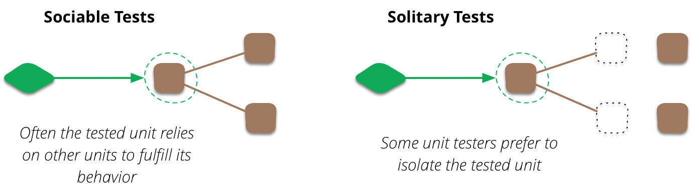

# **허니콤(Honeycomb) 전략을 선택한 이유**

### **완벽한 테스트 전략이라는 환상**

나는 업계의 모범 답안으로 여겨지는 '테스트 피라미드' 전략을 충실히 따랐다. 수많은 단위 테스트로 코드 대부분을 촘촘히 덮고, 통합 테스트와 E2E 테스트는 최소화하는 방식이었다. 이론적으로는 완벽했다.

하지만 현실은 달랐다. 촘촘하게 짜인 단위 테스트는 내부 구현의 작은 리팩토링에도 쉽게 깨져나갔다. 나는 기능을 개선하는 시간보다 깨진 테스트를 고치는 데 더 많은 시간을 쏟고 있었다. 피라미드 전략은 나에게 자신감 대신 '유지보수 비용'이라는 무거운 짐만 안겨주었다. 테스트는 변화를 독려하는 안전망이 아니라, 변화를 가로막는 장애물이 되어가고 있었다.

이런 경험들은 나에게 테스트 피라미드 전략에 대한 근본적인 회의감을 안겨주었다. 뭔가 다른 관점이 필요했다.

바로 그때, J.B.Rainsberger가 제시한 아이디어에서 실마리를 찾았다. 테스트의 초점을 개별 클래스의 내부 구현이 아닌, 컴포넌트 간의 `협력(Collaboration)`과 `계약(Contract)`으로 옮겨야 한다는 새로운 관점이었다. 그리고 이 철학을 바탕으로 실용적인 전략을 구현한 Spotify의 사례를 발견했다.

이 글은 '모범 답안'이라 믿었던 테스트 피라미드에 의문을 품고, 내 프로젝트의 고통스러운 문제들을 해결하기 위해 새로운 답을 찾아 나선 여정의 기록이다. 그리고 그 끝에서 발견한 **허니콤(Honeycomb) 테스트 전략**이 어떻게 나에게 잃어버렸던 개발의 자신감과 속도를 되찾아주었는지 이야기하고자 한다.

---

## **1. 혼란의 탑을 허물기 전에: 용어부터 바로잡기**

테스트 전략에 대한 논의는 종종 길을 잃는다. 그 이유는 우리가 서로 다른 지도를 들고 같은 목적지를 이야기하기 때문이다. Martin Fowler는 그의 글 "On the Diverse And Fantastical Shapes of Testing"에서 이 문제를 명확히 지적했다.

> "사람들이 단위 테스트와 통합 테스트의 차이를 무엇으로 보는지 분명하지 않다는 사실 때문에 (테스트 전략에 대한) 논의는 불투명해진다."
>
> _"it's rendered opaque by the fact that it's not clear what people see as the difference between unit and integration tests."_

그의 말처럼 '단위 테스트'라는 단어는 사람마다 다르게 해석된다. 이 혼란의 중심에는 **'의존 객체(dependent objects)를 어떻게 다룰 것인가'**라는 질문이 있다. Martin Fowler는 이 질문에 대한 접근 방식에 따라 단위 테스트 스타일을 두 가지로 명쾌하게 분류했다.



- **고립된 단위 테스트 (Solitary Unit Test):** 테스트 대상(Unit)의 의존성을 모두 테스트 더블(Mock, Stub 등)로 대체하여, 외부의 영향 없이 오직 그 대상의 동작만을 고립시켜 검증하는 스타일.
- **사교적인 단위 테스트 (Sociable Unit Test):** 테스트 대상이 의존하는 실제 객체들(같은 프로세스 내의)과 함께 동작시키며, 객체들 간의 상호작용 속에서 대상의 동작을 검증하는 스타일.

이 구분을 적용하자, 허니콤 논쟁의 본질이 드러나기 시작한다. 허니콤 전략의 핵심은 **'고립된(Solitary) 테스트'의 비중을 줄이고, 실제 객체들의 협력을 검증하는 '사교적인(Sociable) 테스트'에 집중하자**는 패러다임의 전환이다. 따라서 이 글의 나머지 부분에서 혼동을 피하기 위해, 다음과 같이 세 가지 테스트 유형을 명확히 정의하고 사용하겠다.

- **단위 테스트 (Unit Test):** 오직 **고립된(Solitary)** 스타일의 테스트만을 지칭한다. Mock을 사용하여 하나의 클래스나 함수를 격리 검증한다. 네트워크, DB 접근 등 외부 세계와의 소통은 일절 없다.

- **통합 테스트 (Integration Test):** **사교적인(Sociable)** 스타일의 테스트를 중심으로, 내가 작성한 여러 컴포넌트들이 실제 의존성과 함께 협력하는 것을 검증한다.

  - **경계:** 데이터베이스나 메시지 큐는 Testcontainers 등으로 직접 띄워 사용한다. 하지만 내가 **제어할 수 없는 외부 서드파티 API나 서비스는 Mocking 한다.** 이것이 E2E 테스트와의 결정적인 차이점이다.

- **E2E (End-to-End) 테스트:** **실제 사용자의 관점에서, 배포된 환경과 거의 동일한 조건으로 전체 시스템의 흐름을 검증하는 테스트.**
  - **경계:** 프론트엔드부터 백엔드, 데이터베이스, 그리고 **외부 서드파티 서비스까지 Mocking 없이** 실제 연동을 통해 테스트한다.

---

## **2. 피라미드의 배신: 왜 (고립된) 단위 테스트는 나를 구원하지 못했나?**

테스트 피라미드는 수년간 테스트 전략의 교과서로 여겨져 왔다. 나 역시 이 '모범 답안'을 충실히 따랐다. 하지만 프로젝트가 성장하면서 피라미드는 나를 보호하는 요새가 아니라, 나의 발목을 잡는 감옥이 되어갔다.

### **리팩토링의 적이 되어버린 테스트**

가장 큰 고통은 리팩토링 과정에서 찾아왔다. 내부 구현을 개선하기 위해 서비스 클래스의 private 메서드 하나를 수정했을 뿐인데, 관련도 없어 보이는 10개의 테스트가 한꺼번에 실패했다. 실패의 원인은 제품 코드가 아니라, 내부 구현에 강하게 결합된 Mock 객체들의 행위(behavior) 정의 때문이었다. 테스트는 리팩토링에 대한 자신감을 줘야 하는데, 오히려 변화를 가로막는 가장 큰 장애물이 된 것이다.

### **ROI 없는 노동, 그리고 사라진 본질**

나는 코드 커버리지라는 허울 좋은 지표를 맞추기 위해, 중요하지 않은 Getter/Setter까지 테스트하며 ROI(투자 대비 수익)가 거의 없는 노동을 반복하고 있었다. 결국 테스트는 더 이상 내 소프트웨어의 동작을 설명하는 '살아있는 문서'가 아니었다. 그저 통과시켜야 할 또 하나의 귀찮은 과제일 뿐이었다.

### **초록 불의 환상**

무엇보다 가장 위험했던 것은, 수백 개의 단위 테스트가 모두 '초록 불'을 밝혔음에도 불구하고 시스템이 배포 후에 예상치 못하게 실패하는 경험이었다. 각 부품(클래스)은 완벽하게 작동했지만, 그 부품들을 조립했을 때(통합했을 때) 삐걱거렸다. 고립된 단위 테스트는 이 '협력(Collaboration)'의 실패를 전혀 감지하지 못했다. 나는 수많은 초록 불이 주는 거짓된 안정감에 빠져 있었다.

---

## **3. 새로운 길의 발견: 협력(Collaboration)과 계약(Contract)의 관점**

테스트 피라미드의 한계 속에서, 나는 J.B. Rainsberger가 제시한 두 가지 관점을 통해 테스트를 근본적으로 재정립하게 되었다. 그것은 엄격한 규칙이 아니라, 우리가 작성하는 테스트를 바라보는 두 가지 다른 렌즈와 같았다: 바로 **'협력(Collaboration)의 렌즈'**와 **'계약(Contract)의 렌즈'**다.

### **협력 (Collaboration)의 렌즈: "우리는 올바르게 소통하고 있는가?"**

이 렌즈를 통해 테스트를 바라볼 때, 우리의 핵심 질문은 이것이다: **"어떤 역할을 수행하기 위해, 객체들은 서로 어떻게 상호작용하는가?"** 여기서 중요한 것은 '상호작용' 그 자체다. 이 관점은 우리를 개별 클래스의 미시적인 내부 구현에서 벗어나, 시스템의 흐름과 구조라는 거시적인 그림을 보게 한다.

### **계약 (Contract)의 렌즈: "각자는 자신의 약속을 지키고 있는가?"**

이 렌즈를 통해 테스트를 바라볼 때, 우리의 핵심 질문은 이것이다: **"외부 세계에 공개된 이 컴포넌트의 약속(API, 인터페이스)은 무엇이며, 그 약속을 충실히 이행하는가?"** 계약 테스트는 "추상화를 사용하는 예제" 또는 "공개 API를 사용하는 예제"와 같다. 컴포넌트가 외부 세계에 제공하기로 약속한 기능과 동작을 독립적으로 보증하는 것이다.

### **Spotify의 전략: 계약을 통해 협력을 검증하다**

Spotify의 허니콤 전략은 이 두 개념을 영리하게 융합했다.

1.  **'계약(Contract)'을 테스트의 입구와 출구로 삼는다:** 그들은 마이크로서비스의 공개된 '계약'(REST API, Pub/Sub 메시지)을 테스트의 실행(`Act`)과 검증(`Assert`) 지점으로 사용한다.

2.  **'협력(Collaboration)'을 테스트의 대상으로 삼는다:** API를 통해 들어온 요청이 서비스 내부의 여러 컴포넌트와 실제 데이터베이스를 거쳐 올바른 응답으로 반환되는 전 과정을 테스트한다. 즉, **서비스 내부 컴포넌트들의 총체적인 '협력'**이 바로 검증의 대상이다.

결론적으로 Spotify의 전략은 **"서비스의 외부 '계약'을 통해, 그 내부 컴포넌트들의 '협력'을 검증하는 것"**이라 정의할 수 있다.

---

## **4. 모놀리식 아키텍처를 위한 허니콤 전략 설계하기**

"이 전략은 마이크로서비스 환경에서만 유효한 것일까? 나의 모놀리식 아키텍처에도 적용할 수 있을까?"

결론부터 말하자면, "그렇다." 허니콤 전략의 본질은 배포 아키텍처의 형태가 아니라, **논리적으로 명확한 경계를 가진 '설계 단위'**를 테스트의 중심으로 삼는다는 데 있기 때문이다.

나의 프로젝트는 비록 모놀리식이지만, 내부적으로 각 도메인(주문, 결제, 알림 등)이 명확히 구분되어 있고, 이 도메인들은 비동기 '이벤트'를 통해 느슨하게 결합되어 있다. 이 구조에서 각 도메인은 Spotify의 마이크로서비스와 정확히 같은 역할을 한다. 명확한 '계약'(API, 이벤트)을 가지며, 독립적인 '협력' 단위로 기능한다.

따라서 나는 Spotify와 동일한 결론에 도달했다. 나의 새로운 **'단위(Unit)'는 개별 클래스가 아니라, 외부 의존성(DB, 메시지 큐)과 함께 동작하는 '도메인 서비스' 전체**가 되어야 한다.

---

## **5. 실전: 나만의 허니콤 테스트 전략 구축기**

이제 나의 모놀리식 아키텍처를 위해 재구성한 허니콤 테스트 전략의 구체적인 모습이다. 이 전략의 최종 목표는 단순히 버그를 찾는 것을 넘어, 테스트가 더 나은 설계를 이끄는 나침반이 되는 것이다.

### **통합 테스트 (Integration Tests)**

이 전략의 심장이자 가장 많은 비중을 차지하는 부분이다.

- **테스트 대상:** 도메인 서비스의 공개(public) API.
- **목표:** 개별 클래스의 구현이 아닌, **비즈니스 유스케이스가 올바르게 동작하는지**를 검증한다.
- **원칙:** **"실제에 가깝게, 하지만 통제 불가능한 외부 서비스는 피해서 빠르게."** 데이터베이스, 메시지 큐 등은 **Testcontainers**를 사용하고, 외부 서드파티 API는 Mocking 한다.
- **코드 예시 (`OrderService` 통합 테스트):**

  ```java
  @SpringBootTest
  @ActiveProfiles("test")
  @Testcontainers
  class OrderServiceIntegrationTest {

      @Container
      static PostgreSQLContainer<?> postgres = new PostgreSQLContainer<>("postgres:15-alpine");

      @Autowired
      private OrderService orderService;

      @Autowired
      private OrderRepository orderRepository;

      @Test
      void placeOrder_success() {
          // Given
          Product testProduct = productRepository.save(new Product("Test Item", 10000));
          OrderRequest request = new OrderRequest(testProduct.getId(), 5);

          // When
          Long orderId = orderService.placeOrder(request);

          // Then
          Optional<Order> foundOrder = orderRepository.findById(orderId);
          assertThat(foundOrder).isPresent();
          assertThat(foundOrder.get().getTotalPrice()).isEqualTo(50000);
      }
  }
  ```

- **Trade-off (장단점):**
  - 👍 **장점:** 압도적인 신뢰도를 제공하며, 테스트 코드가 곧 비즈니스 요구사항을 설명하는 '살아있는 문서'가 된다.
  - 🤔 **고려할 점:** 고립된 단위 테스트에 비해 상대적으로 실행 시간이 더 소요될 수 있다. 하지만 최신 하드웨어와 Testcontainers 기술 덕분에, 얻는 신뢰도에 비하면 충분히 감수할 가치가 있는 비용이다.

### **단위 테스트 (Unit Tests)**

복잡한 로직의 '어떻게(How)'를 정밀하게 검증한다.

- **테스트 대상:** 복잡한 비즈니스 규칙을 가진 도메인 객체, 순수 함수.
- **목표:** **오직 계산 로직의 정확성**만을 다양한 엣지 케이스에 대해 검증한다.
- **코드 예시 (`DiscountCalculator` 단위 테스트):**

  ```java
  class DiscountCalculatorTest {
      private final DiscountCalculator calculator = new DiscountCalculator();

      @Test
      void calculate_vipUser_withHolidayCoupon() {
          // ... Given, When, Then
          int discountAmount = calculator.calculate(new User(UserGrade.VIP), new Coupon(CouponType.HOLIDAY), 10000);
          assertThat(discountAmount).isEqualTo(3000);
      }
  }
  ```

### **작은 상단: E2E 테스트 (End-to-End Tests)**

시스템의 생존을 확인하는 최후의 보루.

- **테스트 대상:** 사용자의 가장 중요하고 핵심적인 여정(Critical User Journey) 1~2개.
- **목표:** **시스템이 살아있고 핵심 기능이 동작함을 보증**하는 것.
- **코드 예시 (Cypress 의사 코드):**
  ```javascript
  describe("Order Process E2E Test", () => {
    it("allows a user to order a product successfully", () => {
      // ... Given, When, Then
      cy.visit("/products/123").get("[data-cy=order-button]").click();
      cy.contains("주문이 성공적으로 완료되었습니다.");
    });
  });
  ```

---

## **결론: 정답은 없다, 프로젝트에 맞는 전략만 있을 뿐**

테스트 전략을 논하기 전에, 우리는 가장 본질적인 질문으로 돌아가야 한다: **나는 왜 테스트를 작성하는가?**

그것은 단순히 버그를 찾거나 코드 커버리지를 높이기 위함이 아니다. 내가 작성한 코드가 의도대로 동작하고, 미래의 변경에도 쉽게 부서지지 않을 것이라는 **'자신감'**을 얻기 위해서다.

이 본질을 잊는 순간, 우리는 길을 잃는다. 과거의 나는 유행처럼 번진 '테스트 피라미드'를 비판 없이 수용했다. 서로 다른 의미로 '단위 테스트'를 이야기하며 불필요한 논쟁을 하기도 했다. 무엇보다, '테스트가 깨져서 고통스럽다'는 현상 이면의 진짜 문제가 무엇인지 명확히 짚지 못했다.

허니콤 전략을 찾아 나선 이 여정은 단순히 테스트 코드를 바꾸는 과정이 아니었다. 이 모든 잘못된 관행을 바로잡는 과정이었다.

1.  **리팩토링의 자신감 회복:** 이제 나의 주력 테스트는 도메인 서비스의 외부 '계약(API)'에 집중한다. 내부 구현을 자유롭게 변경해도, 이 계약만 지켜진다면 테스트는 깨지지 않는다.

2.  **신뢰할 수 있는 피드백 확보:** 테스트의 '초록 불'은 더 이상 개별 클래스만의 성공을 의미하는 '환상'이 아니다. 그것은 비즈니스 유스케이스 하나가 모든 '협력'을 성공적으로 마쳤다는, 실질적인 **자신감**을 주는 증거다.

3.  **모든 테스트의 가치 상승:** 모든 테스트가 각자의 명확한 존재 이유를 갖게 되면서, 나의 테스트 스위트는 양만 많은 잡동사니가 아닌, 작지만 의미 있는 **'살아있는 명세서'** 컬렉션이 되었다.

결국 중요한 것은 피라미드나 허니콤이라는 모양이나 이름이 아니었다. 가장 중요한 것은 **내 프로젝트의 아키텍처를 깊이 이해하고(4장), 내가 겪는 문제의 본질을 명확히 정의한 뒤(2장), '테스트의 진짜 목적'에 가장 높은 가치를 제공하는 전략을 스스로 선택하는 과정** 그 자체였다.

완벽한 테스트 전략이라는 '은총알'은 세상에 존재하지 않는다. 하지만 내 코드의 아키텍처를 깊이 이해하고, 테스트의 본질적인 가치에 대해 끊임없이 질문한다면, 우리 각자에게 가장 효율적이고 가치 있는 최적의 전략을 찾아낼 수 있다.

### 참고

- [Pyramid or Crab? Find a testing strategy that fits - web.dev](https://web.dev/articles/ta-strategies)

- [Beware the Integrated Tests Scam: A Retrospective And An Apology - J.B. Rainsberger - Youtube](https://www.youtube.com/watch?v=NGs23Q8WHxA)

- [Testing of Microservices - Spotifiy](https://engineering.atspotify.com/2018/01/testing-of-microservices)

- [On the Diverse And Fantastical Shapes of Testing - Martin Fowler](https://martinfowler.com/articles/2021-test-shapes.html)

- [What is the Test Honeycomb? (and why you should care) - Yan Youtube](https://www.youtube.com/watch?v=p3M1Y2Oi_Yk)

- [The Practical Test Pyramid - Ham Vocke](https://martinfowler.com/articles/practical-test-pyramid.html)
